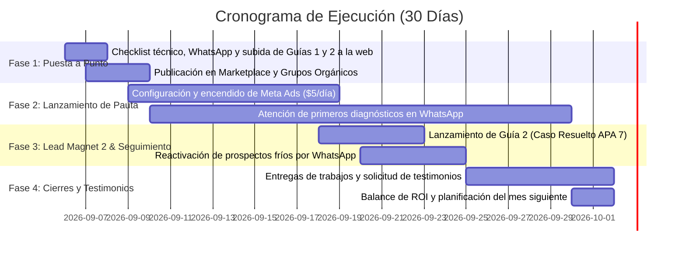

# Cronograma de Ejecución Inmediato: Campaña de 30 Días para Captar Tesistas
### (Versión actualizada — pricing en 3 niveles, entregables reales, Guía 2 integrada)

**Responsable:** Angela Gutiérrez — Economista, Universidad de Los Andes (2003)
**Objetivo del Mes:** Captar entre 5 y 8 clientes distribuidos en 3 paquetes (ver sección 0)
**Canales:** Meta Ads ($5 USD/día), Facebook Marketplace, Grupos de Facebook, WhatsApp Directo
**Activos:** Web App (`asesoriaestadisticatesis.streamlit.app`) con **2 guías descargables**, WhatsApp Business
**Contacto:** WhatsApp +58 424 747 4381 — Atención remota para docentes de toda la región

---

## 0. Estructura de precios (unificada)

| Paquete | Para quién | Qué incluye | Precio |
|---|---|---|---|
| **Diseño** | Parte de cero, sin instrumento | Instrumento + validación de contenido (V de Aiken) + ficha técnica + cálculo de muestra | **S/280** |
| **Análisis** | Ya tiene datos recolectados | Limpieza de base, validación, descriptivo e inferencial, documento redactado, sesión pre-sustentación, 2 revisiones | **S/450** |
| **Integral** | Necesita que se recolecten los datos | Todo lo anterior + aplicación de encuesta vía redes digitales | **S/750** |

El anuncio publicado sigue mostrando "Desde S/280" — el diagnóstico de 10 minutos (Semana 2) es el momento donde se determina cuál paquete corresponde a cada prospecto.

**Proyección de ingresos realista** (mezcla estimada de 3 Diseño + 3 Análisis + 1-2 Integral): **S/2,600 – S/4,100** por 5-8 clientes cerrados.

---

## 1. Visión General del Cronograma (Gantt de 4 Semanas)

---

## 2. Plan de Acción Detallado: Día por Día

### Semana 1: Configuración, Siembra Orgánica y Lanzamiento de Pauta

#### Día 1 (Hoy): Puesta a punto de canales y mensaje de bienvenida
* [ ] **Landing page:** Subir el archivo `Guia1_5_Errores.docx` y `Guia2_Caso_Resuelto_APA7.docx` a `asesoriaestadisticatesis.streamlit.app` (código de descarga ya preparado — sección "Recursos gratuitos").
* [ ] **WhatsApp Business:** Configurar el mensaje de bienvenida automático:
  > *«Hola, gracias por escribir. Soy Angela Gutiérrez, economista (Universidad de Los Andes, 2003), especialista en metodología aplicada a educación. Tengo 2 guías gratuitas para tesistas de Educación, las encuentras aquí: asesoriaestadisticatesis.streamlit.app. Cuéntame en qué etapa está tu tesis y te hago un diagnóstico rápido sin costo.»*
* [ ] **Instagram Bio:** Actualizar la biografía:
  > *Angela Gutiérrez | Economista, Universidad de Los Andes*
  > *Resuelvo la estadística de tu tesis de Educación.*
  > *Descarga gratis mis 2 guías 👇*
  > *[asesoriaestadisticatesis.streamlit.app]*
* [ ] **Facebook Marketplace:** Publicar el anuncio con la ficha técnica y precio `Desde S/ 280` en Lima (y replicar en Arequipa y Trujillo).

#### Días 2 y 3: Siembra en Grupos Académicos (Tráfico $0)
* [ ] Unirse a 5 grupos activos de Facebook:
  * *Tesis de Maestría en Educación Perú*
  * *Tesistas UCV Educación*
  * *Docentes e Investigadores Educativos*
  * *Asesoría de Tesis y Metodología Perú*
* [ ] Publicar un post de alto valor sin vender directamente:
  > *«Colegas docentes, preparando una asesoría noté que muchos asesores rechazan el capítulo de resultados por usar t de Student en escalas Likert de 1 al 5. En educación casi siempre debemos verificar primero el supuesto de normalidad (Shapiro-Wilk si tu muestra es menor a 50, Kolmogorov-Smirnov si es mayor) y usar Rho de Spearman cuando no se cumple. Subí a mi web una guía gratuita con los 5 errores estadísticos más comunes para que los revisen antes de entregar: asesoriaestadisticatesis.streamlit.app. Espero les sirva.»*

#### Días 4 y 5: Creación y Encendido de Campaña en Meta Ads
* [ ] **Objetivo de campaña:** Clientes potenciales (Mensajes directos a WhatsApp) o Tráfico al enlace web.
* [ ] **Presupuesto diario:** $5 USD / día (~S/ 19 - S/ 20 PEN).
* [ ] **Segmentación:** Perú (Lima, La Libertad, Arequipa, Junín, Lambayeque), 26-52 años, intereses en *Educación*, *Maestría*, *Docencia escolar*, *Tesis*.
* [ ] **Creativos (2 anuncios en rotación):** los ya validados con paleta Ciruela/Oro — "Análisis en 48h si ya tienes datos. Diseño y validación si partes de cero."

---

### Semana 2: Gestión de Conversaciones y Cierres (Días 6 a 14)

#### Rutina Diaria de Atención (40 minutos al día):
* [ ] **Mañana (15 min):** Responder mensajes entrantes de la noche anterior. Enviar el link de la web a quienes pidan alguna guía.
* [ ] **Tarde (20 min):** Enviar los **audios de 1 a 2 minutos** con el diagnóstico preliminar a quienes compartieron su tema o matriz de consistencia — en el diagnóstico se define qué paquete corresponde (Diseño / Análisis / Integral).
* [ ] **Noche (5 min):** Presentar la oferta del paquete correspondiente a los docentes diagnosticados en el día.

> [!TIP]
> **Tasa esperada de Semana 2:** Recibir entre 10 y 15 mensajes en WhatsApp. Meta: Cerrar los primeros **2 clientes** (aprox. S/560–900 facturados, según mezcla de paquetes, cubriendo el costo total del mes de publicidad).

---

### Semana 3: El Segundo Gancho (Guía 2 — Caso Resuelto) y Reactivación (Días 15 a 21)

#### Día 15: Publicación de la Guía 2
* [ ] Confirmar que `Guia2_Caso_Resuelto_APA7.docx` esté visible y descargable en la web (ya subido desde el Día 1).
* [ ] Publicar en Instagram (feed):
  > *«¿Sabías que el 70% de las tesis de maestría en Educación son descriptivo-correlacionales con escalas Likert? Preparé un caso resuelto completo — con tablas de niveles (bajo/medio/alto), prueba de normalidad y correlación de hipótesis, redactado tal como lo espera tu jurado en APA 7. Gratis, en el link de mi bio.»*
* [ ] Publicar el mismo aviso (con tono de valor, no venta) en los grupos de Facebook usados en el Día 2.

#### Día 16: Historia de Instagram con interacción
* [ ] Publicar una historia con sticker de preguntas:
  > *«¿Qué prueba estadística te está pidiendo tu asesor?»*
* [ ] Responder a cada docente que participe con un mensaje privado ofreciendo el link de la Guía 2 y ofreciendo el diagnóstico gratuito.

#### Día 17: Recordatorio en WhatsApp Status
* [ ] Publicar un estado de WhatsApp mostrando una captura de una de las tablas del caso resuelto (ej. la Tabla 3 de niveles), con el texto: *"Nueva guía gratis — link en mi bio de Instagram / escríbeme 'CASO'."*

#### Días 18 a 21: Reactivación de prospectos de la Semana 1
* [ ] Enviar un mensaje de seguimiento a los docentes que pidieron la Guía 1 pero aún no contrataron:
  > *«Hola [Nombre], ¿cómo estás? Quería compartirte un nuevo material que preparé: un capítulo de resultados resuelto completo en APA 7 — con tablas de niveles y prueba de hipótesis — para que veas cómo se redacta. Lo encuentras en el mismo link: asesoriaestadisticatesis.streamlit.app. Si necesitas que adaptemos esto a tu propia base de datos, avísame y coordinamos.»*
* [ ] **Meta de Semana 3:** Cerrar **2 a 3 clientes adicionales** a través del seguimiento.

---

### Semana 4: Entrega, Testimonios y Escala (Días 22 a 30)

#### Días 22 a 26: Entregas y Sesiones de Explicación
* [ ] Entregar los primeros trabajos terminados:
  * Documento Word con validación del instrumento, estadística descriptiva e inferencial, tablas y redacción interpretativa lista para revisión del asesor.
  * Realizar la **sesión de 40 min por Zoom/Meet** explicando los resultados para la defensa.

#### Días 27 a 29: Captura de Testimonios
* [ ] Una vez que el docente revisa el trabajo y queda satisfecho, solicitar un mensaje o audio de recomendación:
  > *«Colega, me alegra muchísimo que el capítulo haya quedado listo para tu asesor. ¿Te importaría darme una breve opinión de cómo te sentiste con la asesoría para compartirla en mi web (con tus iniciales)? Me ayuda un montón a seguir apoyando a otros profesores.»*
* [ ] Tomar captura de WhatsApp al testimonio (con permiso explícito) y publicarlo en Instagram y en la landing page.

#### Día 30: Balance Mensual
* [ ] Calcular métricas:
  * Inversión publicitaria total: ~$150 USD.
  * Clientes totales cerrados (Meta: 5 a 8), desglosados por paquete (Diseño / Análisis / Integral).
  * Ingresos netos generados.
  * Decidir si aumentar el presupuesto a $8 o $10 USD/día para el mes siguiente.

---

## 3. Guía Rápida de Respuestas para Objeciones en WhatsApp

| Objeción del Docente | Respuesta Sugerida de Angela |
| :--- | :--- |
| *«¿Por qué tú si eres economista y mi tesis es de educación?»* | *«Soy economista de la Universidad de Los Andes, formación con base cuantitativa rigurosa. Mi trabajo no es decirte cómo enseñar en el aula, sino traducir tus instrumentos y observaciones pedagógicas a un análisis estadístico correcto para tu jurado.»* |
| *«¿Qué pasa si mi asesor me hace observaciones a los números?»* | *«Los paquetes de Análisis e Integral incluyen 2 rondas completas de revisiones sin costo adicional. Si tu asesor te observa alguna tabla o pide otra prueba, la ajustamos juntos.»* |
| *«¿Cómo es la forma de pago?»* | *«Depende del paquete: Diseño (S/280) se paga completo al iniciar, al ser un solo entregable. Análisis (S/450) e Integral (S/750) se trabajan con 50% de anticipo y 50% contra entrega de resultados preliminares.»* |
| *«Tengo los datos pero no están limpios en Excel.»* | *«No te preocupes. Me envías tu archivo tal cual lo tienes (o las respuestas de Google Forms) y yo me encargo de depurar la base, codificar las variables y verificar valores perdidos — eso está incluido en el paquete de Análisis.»* |

---

## 4. Métricas de Control Semanal (Checklist de Seguimiento)

Lleva el conteo cada domingo en una libreta o Excel:

* **Semana 1:** ______ chats iniciados | ______ diagnósticos enviados | ______ clientes cerrados (por paquete: ___D ___A ___I)
* **Semana 2:** ______ chats iniciados | ______ diagnósticos enviados | ______ clientes cerrados (por paquete: ___D ___A ___I)
* **Semana 3:** ______ chats iniciados | ______ diagnósticos enviados | ______ clientes cerrados (por paquete: ___D ___A ___I)
* **Semana 4:** ______ chats iniciados | ______ diagnósticos enviados | ______ clientes cerrados (por paquete: ___D ___A ___I)
* **Total del Mes:** ______ clientes | **Facturación Total:** S/ ___________
